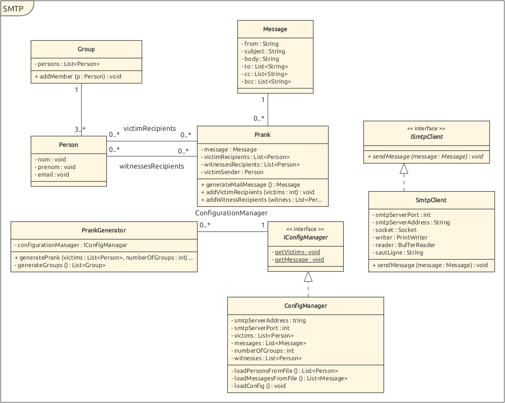

# RES - Lab04 - SMTP

Auteurs : Sauge Ryan, Viotti Nicolas

## Introduction

Ce repository est issu d'un laboratoire pour nos études. Le but de ce laboratoire était de simuler des "pranks" consistant à envoyer des mails sur un serveur SMTP. L'utilisateur peut définir l'adresse du serveur, une liste de messages et une liste de victimes qui seront tirés aléatoirement pour l'envoi des pranks.

## Mise en place d'un serveur SMTP Mock

Pour simuler un serveur SMTP, nous allons le conteneurisé avec Docker. Il vous faut donc l'installer au préalable.

https://www.docker.com/get-started

### Démarche

Pour le serveur SMPT, vous allez le choix entre 2 installations possibles :

**Version basique :**

Depuis le dosser racine du projet, aller dans le dosser nommé docker et exécuter run-container.sh. Celui-ci prendra alors l'exécutable MockMock-1.4.0.one-jar.jar disponible dans le dossier 

Exemple avec un terminal bash

> cd docker 
>
> chmod +x ./*.sh 
>
> ./run-container.sh 

**Version évoluée :**

Si vous souhaitez avoir la dernière version de MockMock, vous pouvez cloner en local sur votre machine le repo depuis le gihub du projet : https://github.com/tweakers/MockMock

Une fois cela fait, copier/coller le dossier nommé "docker" du projet dans le dossier de votre MockMock et exécutez les scripts build-image.sh puis run-container.sh

build-image.sh  va créer l'image à partir de votre MockMock et run-container.sh va l'exécuter dans votre Docker. 

### Résultat

Sous Docker, vous devriez voir un container dans l'état running avec le port 2525.

Ainsi, votre serveur MockMock tournera en arrière plan sous votre Docker. Il vous sera ensuite accessible en localhost au port 2525.

## Configuration et exécution

### Configuration

Commencez par cloner le projet sur votre machine.

Les fichiers de configuration sont des fichiers JSON. Ils sont aux nombres de trois et sont contenus dans le dossier main/config/ du projet. Vous pouvez modifier les fichiers à votre guise pour modifier les paramètres de l'application en fonction de vos attentes.

- config.json
- victims.json
- messages.json

#### config.json

- smtpServerAddress : l'adresse IP du serveur SMTP visé
- smtpServerPort : le port du serveur SMTP
- numberOfGroups : Le nombre de groupes qui seront formés pour les pranks. Un groupe contiendra au moins 3 personnes(un envoyeur, et deux destinataires). Prévoyez donc un nombre de victimes (voir victims.json) suffisamment grand.
- witnessesToCC : les adresses email en copie cachée, à séparer par une virgule. (a@b.com,b@c.com)

#### victims.json

Afin d'ajouter une nouvelle personne, copier la structure "personne", crochet extérieurs compris

- nom : le nom de la personne
- prenom : le prénom de la personne
- email : l'adresse email de la personne

Les groupes seront formés de la manière suivante : on tirera au-hasard dans les victimes un envoyeur et deux destinataires.

#### messages.json

Afin d'ajouter un nouveau message, copier la structure "message", crochets extérieurs compris

- text : Le corps du message
- subject : Le sujet du message

Un groupe tirera un des messages de cette liste aléatoirement en tant que prank.

### Exécution

Une fois les fichiers de configuration édités, il suffit de lancer le projet pour envoyer les emails.

NB : L'envoyeur et le message sont tirés au hasard dans la liste disponible.

## Description de l'implémentation

### Package config

Ce package permet la lecture des fichiers de config en JSON et la création des listes de messages, de victime et de "témoins" (cc). Il met en place des méthode get permettant aux autres classes de récupérer les objets (listes) créées à partir des fichiers de config.

### Package mail

Ce package contient les classes Group, Message et Person.

#### Message

Un message contient un envoyeur, des destinataires, un sujet, un corps de message et des "témoins". Il est créé par un Prank pour être envoyé au SmtpClient.

#### Person

Person est la classe contenant le nom, le prenom et l'email d'une personne. Une personne est créée par le ConfigManager lors de la lecture des fichiers JSON

#### Group

Un groupe contient une liste de personnes, tirées au hasard par le PrankGenerator. Du groupe, PrankGenerator tirera un envoyeur et des destinataires, toujours au hasard, pour créer le Prank.

### Package prank

Ce package contient les classes Prank et PrankGenerator. Le package permet la génération des groupes de Prank ainsi que des corps des messages.

#### PrankGenerator

Lorsqu'il est appelé, PrankGenerator génère un Prank, en utilisant les listes crées par ConfigManager.

Il créé des groupes  en tirant des personnes au hasard dans la liste des personnes disponibles, en fonction du nombre de groupes spécifiés et du nombre de victimes potentielles disponible.

Pour chaque groupe, il tire au hasard l'envoyeur, les destinataires et le message pour créer une instance de l'objet Prank.

#### Prank

Un prank contient les victimes (envoyeur/destinataires), les personnes en CC ainsi que le corps du message. La classe s'occupe également de créer l'objet Message et d'en définir les différents paramètres en fonction de ses propres attributs.

### Package smtp

SmtpClient est la classe qui s'occupe de la connexion, de  communication avec le serveur, de la mise en forme du mail ainsi que de l'envoi de celui-ci.

### Communication Client-Serveur

Voici un exemple de communication entre la classe SmtpClient et le serveur SMTP Mock.

Une fois la connexion établie et le EHLO envoyé au serveur de l'envoyeur, chaque réponse positive du serveur se fera avec le code 250. On envoie dans l'ordre l'adresse email de l'envoyeur, puis le destinataire (il suffit de répéter l'envoi de RCPT avec d'autres adresses pour définir d'autres destinataires). Une fois qu'on souhaite envoyer le corps du message, le client envoie DATA, attends la réponse 352 qui indique comment terminer les DATA et envoie le corps du mail, qu'il termine par un envoi de "."

Lorsqu'il souhaite quitter, le client envoie QUIT et recevra un 221 indiquant que le serveur SMTP des destinataires a clos la transmission.

# Exemple

### Installation basique

1) Cloner le repo, déplacer-vous dans le dosser smtp/docker, rendez les scripts exécutables puis lancer la version basique du script : build-image-basique.sh

2) Ces 2 messages indiquent que la commande build a pu créer l'image et celle-ci s'appelle smtp_sauge_viotti/smtp

3) Ensuite, toujours dans le dossier docker, lancez le script run-container.sh qui va exécuter le container à partir de l'image précédemment créée

4) Ensuite déplacez-vous dans le dossier target, qui se trouve à la racine du repository et exécuter le fichier jar smtp-1.0-SNAPSHOT-jar-with-dependencies.jar.

Les lignes suivantes indiquent que la connexion a réussie

### Installation évoluée

1) Copier le dossier docker dans le repo cloné de MockMock et exécuter build-image-evoluee.sh

2) Exécuter ./run-container.sh pour exécuter le container depuis l'image précédemment créée

### Vérification des emails

1) Il vous d'abord récupérer l'adresse l'ip de votre docker qui peut se faire avec la commande inspect.

### 

2) Connectez-vous avec l'adresse IP de votre docker et le port sur lequel il tourne